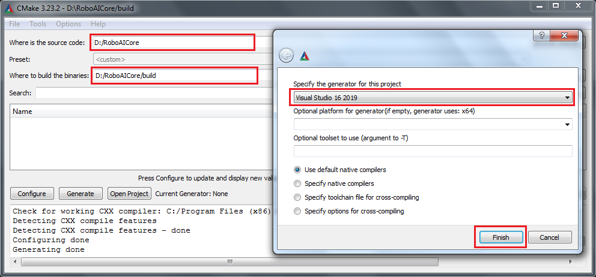
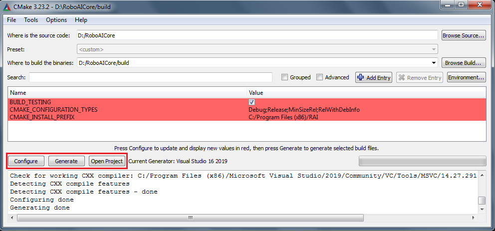
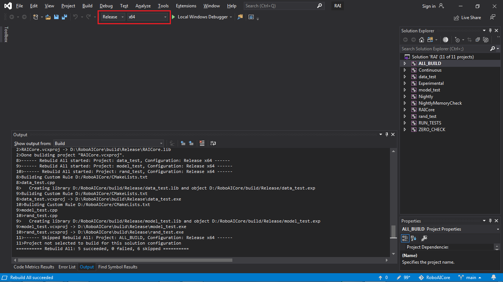

# RoboAI Core Library
Кросплатформенная библиотека глубокого обучения, для мобильных роботов и ПК.

### Функции:
- Нейронные сети прямого распространения,
- Свёрточные нейронные сети,
- Алгоритмы обучения с подкреплением (deep RL)

### Адгоритмы оптимизации:
- SGD,
- Adagrad,
- RMSProp,
- Nesterov,
- Adam,
- Adan (Adaptive Nesterov Momentum Algorithm)

## Сборка и компиляция:
Проект использует систему сборки CMake.
Проект был протестирован на: STM32f429, RaspberryPi 3 model B и персональном компьютере.
Для сборки и компиляции проекта на ПК необходимо наличие установленной программы cmake и компилятора. Далее процесс сборки на примере использования cmake-gui + Visual Studio MSVC:
- скопируйте репозиторий
```bash
 $ git clone --recursive https://github.com/Cognitive-systems-and-technologies/RoboAICore.git
```
- откройте cmake и укажите пути к папке с проектом и папке, в которую будет собран проект, затем нажмите "configure" и выберете тип проекта и компилятор (для VS можно оставить по умолчанию):

- после завершения конфигурации нажмите "generate" и "open project". Проект откроется в VIsual Studio:

- в окне Visual Studio выберите тип компиляции и в меню "Build"->"Rebuild solution"


## Ресурсы:
- Описание функций библиотеки [RoboAICore API](https://github.com/Cognitive-systems-and-technologies/materials/blob/main/RAI_API.pdf).
